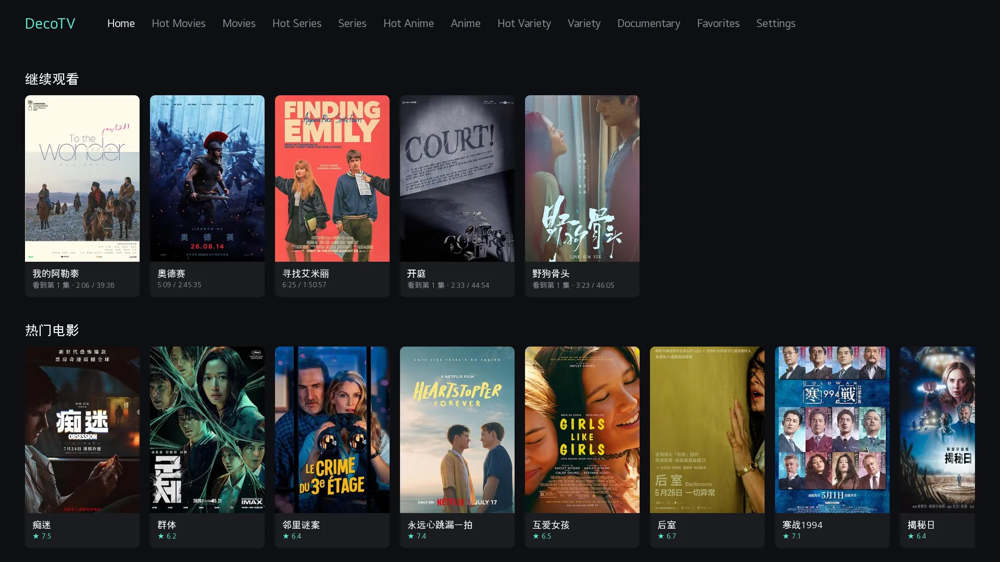
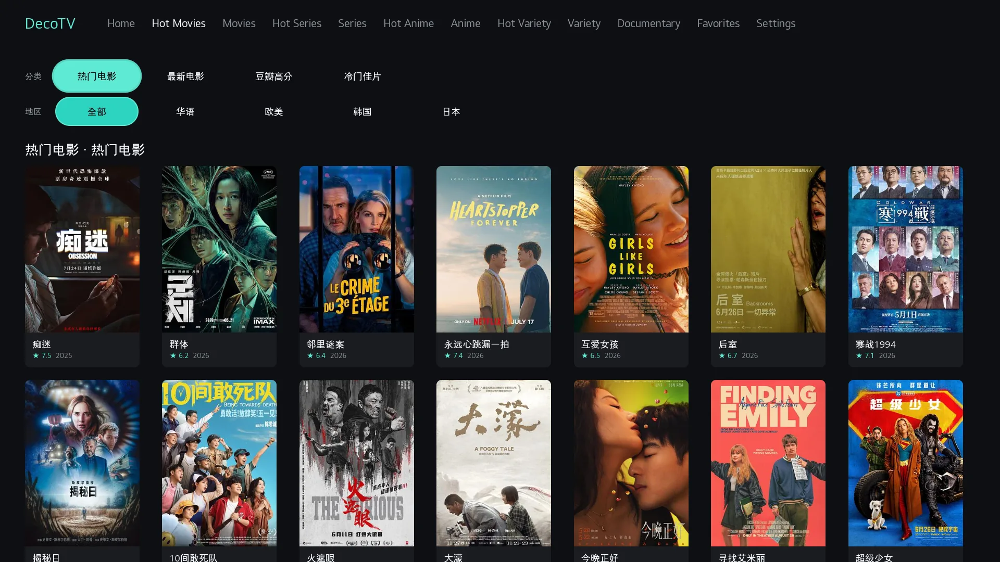
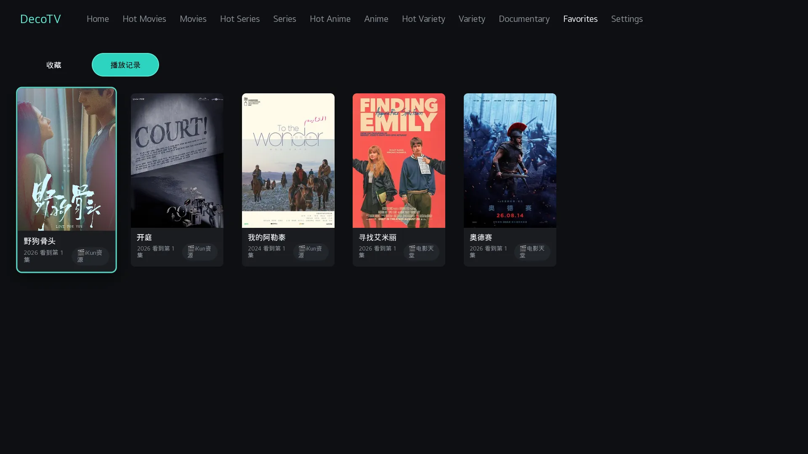
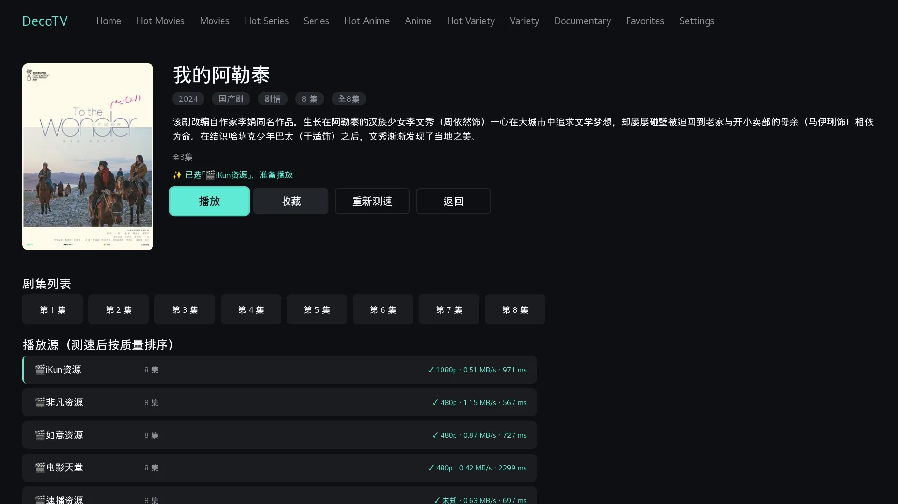
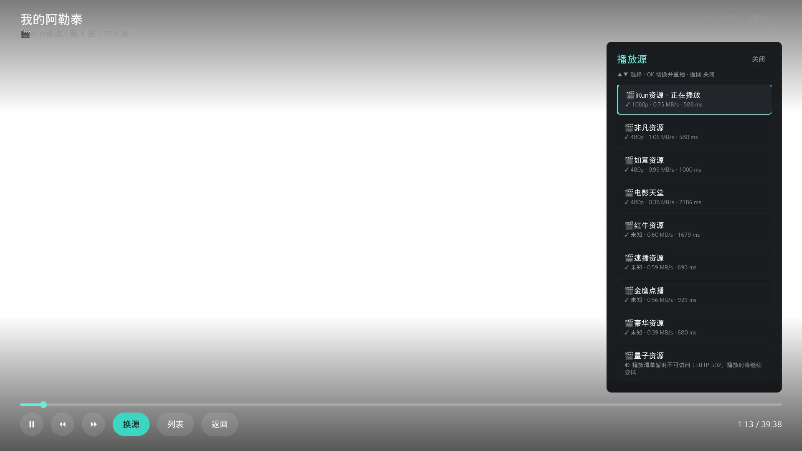
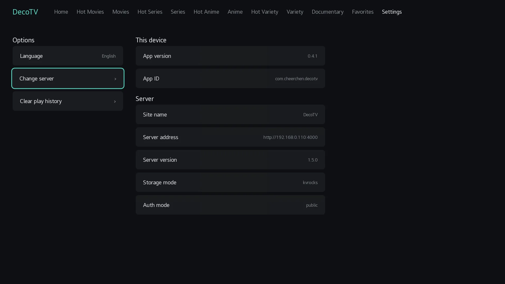

<!-- markdownlint-disable MD033 MD041 -->

<p align="center">
  
</p>

<h1 align="center">DecoTV for webOS</h1>

<p align="center">
  <strong>Native <a href="https://github.com/Decohererk/DecoTV">DecoTV</a> client for LG webOS TVs</strong><br />
  Douban catalog · multi-source probe ranking · full D-pad navigation · hardware decode
</p>

<p align="center">
  <a href="README.md"><b>中文</b></a>
  &nbsp;·&nbsp;
  <b>English</b>
</p>

<p align="center">
  <a href="https://github.com/CheerChen/decotv-webos/stargazers"></a>
  <a href="https://github.com/CheerChen/decotv-webos/releases"></a>
  
  
  
  
  <a href="LICENSE"></a>
</p>

---

## Screenshots

| Home | Category browse | Play history |
| :---: | :---: | :---: |
|  |  |  |

| Detail · multi-source probe | Player · source switch | Settings |
| :---: | :---: | :---: |
|  |  |  |

---

## What this is

A **purpose-built webOS TV client** for [DecoTV](https://github.com/Decohererk/DecoTV) — not a browser wrapper.

- Talks to a self-hosted DecoTV server: Douban catalog, category filters, multi-source search, probe ranking, playback
- TV UI with remote D-pad focus navigation
- Native `<video>` **hardware HLS decode** on webOS (no HLS.js)
- **No root required** — Developer Mode or [Homebrew Channel](https://github.com/webosbrew/webos-homebrew-channel)

The server ships empty: **no built-in media sources**. Configure sources on the DecoTV server.

Current version: `0.5.0`. See [Releases](https://github.com/CheerChen/decotv-webos/releases) and [CHANGELOG.md](CHANGELOG.md).

---

## Features

| Feature | Notes |
| --- | --- |
| Home wall | Continue-watching on top; hot movie, series, anime and variety rows |
| Poster pipeline | Posters are fetched through the webOS JS Service with caching, fallback and trusted-host checks |
| Category browse | Hot + curated tabs for movies, series, anime, variety, documentary; chip filters |
| Multi-source probe ranking | All sources are measured concurrently, ranked by quality, throughput and startup latency; probing continues in the background and playback can start at any time with the best source so far |
| Detail page plays directly | Selecting an episode or a source starts playback; the episode grid sits above the (often long) source list, with the last-watched episode highlighted |
| Failover / manual switch | On failure, the best measured remaining source takes over from where playback stopped; in-player source side panel remains available |
| Progress memory | Keyed by title + year (survives source switch); the play button announces the episode it will resume |
| Outro auto-skip | Mark the outro once in the player and every episode of that show advances automatically at the marked point (never on the last episode); marks are stored as a distance from the end and stay on the TV |
| Library | Favorites & play history sync with the server once signed in, so they follow you across devices; public mode or no session keeps them on the TV |
| Settings layout | Left: actions (change server, clear history, language); right: read-only client + server info |
| Chinese / English UI | Follows the TV language (anything non-Chinese gets English), switchable in Settings; server-supplied content such as titles and genres stays Chinese |
| Remote UX | D-pad / OK / Back; digit keys `0–9` switch navigation; geometry focus engine |
| Player controls | Previous / next episode buttons plus the channel +/− keys; ↑ opens the episode list; left/right seek by 10 seconds; the playback bar and side panels share a five-second idle timer and stay visible while paused |
| Player OSD | Live resolution, buffer and outro marker on the progress bar; episode / source side panels; one-shot mid-roll ad skipping |
| Hardware decode | Platform HLS, no HLS.js |

### Differences from the PC web UI

| Topic | PC / browser DecoTV | This client |
| --- | --- | --- |
| Auth | Account modes | Same; `public` servers can also be browsed anonymously |
| Favorites / progress | Sync via server | Same, once signed in; TV-local otherwise |
| Source config | Server admin | Same — not configured in-app |
| Decode | HLS.js / ArtPlayer, etc. | Platform hardware decode |

**Account mode support:** password-based account mode arrives in `0.5.0`; `0.4.2` only worked against `public` servers. Signing in brings server-side sync of favorites and play history across devices, and the JS service introduced to keep the session also took over poster loading (caching and fallback — `public` mode benefits too).

**How the session survives:** the app loads from `file://`, so API calls are cross-site. The TV webview will not store a `SameSite=Lax` session cookie, and page code can neither read nor set the `Cookie` header. The IPK bundles a webOS JS service that issues requests from its own Node process, outside the webview, where it can persist the cookie and send it back — which is what keeps an account session alive.

**What `public` mode costs:** `/api/login` issues no cookie in that mode, so no account session can be established and `/api/favorites` and `/api/playrecords` answer 401. Browsing, search and playback are unaffected; favorites and play history fall back to TV-local storage with no cross-device sync. For syncing, drop `NEXT_PUBLIC_AUTH_MODE=public` from the server and set `USERNAME` and `PASSWORD`.

**Credential storage:** an account-mode server prompts for a sign-in once, and the username and password are kept in plain text in the TV's `localStorage` so the session can be re-established silently when it expires. That is a deliberate trade for a single-owner TV appliance; on a shared set, do not save an account.

---

## Requirements

1. **LG webOS TV** (Developer Mode or Homebrew Channel; root optional)
2. **DecoTV server** (`public` mode works anonymously; syncing favorites and play history needs an account mode)
3. Network reachability from the TV to the server

Server setup: [DecoTV](https://github.com/Decohererk/DecoTV)

---

## Install

### A — Homebrew Channel (planned)

After listing in [webosbrew/apps-repo](https://github.com/webosbrew/apps-repo), install from Homebrew Channel on the TV.

### B — Developer Mode / sideload

Download a prebuilt IPK from [Releases](https://github.com/CheerChen/decotv-webos/releases).

**Developer Mode:** install with LG’s `ares-install`.

**Rooted TV (opkg path, bypasses appinstalld extraction failures):**

Replace `TV` with the TV’s LAN IP or an SSH host alias from `~/.ssh/config`.

```bash
scp com.cheerchen.decotv_*_all.ipk root@TV:/tmp/decotv.ipk
ssh root@TV 'opkg --add-dest developer:/media/developer install -d developer /tmp/decotv.ipk && \
          mkdir -p /media/developer/apps/usr/palm/applications/ && \
          cp -a /media/developer/usr/palm/applications/com.cheerchen.decotv \
                /media/developer/apps/usr/palm/applications/'
ssh root@TV 'sync; reboot'   # first install needs reboot for sam registration
```

Or package locally:

```bash
./scripts/package.sh
# → com.cheerchen.decotv_<version>_all.ipk
```

---

## Quick start

1. Install and open **DecoTV**
2. Enter the server URL, e.g. `http://192.168.1.10:3000`
3. An account-mode server asks for a sign-in once and re-establishes the session on its own afterwards; `public` servers can be skipped past
4. Browse the home wall with the D-pad; OK opens detail
5. Detail probes sources and starts the best one; switch sources on failure or via the panel
6. The player supports previous / next episode, outro markers and automatic episode advance
7. Favorites and play history live under Library; client and server info are read-only on the right of Settings

---

## Stack

| Layer | Choice |
| --- | --- |
| Runtime | webOS Web App (WAM / Chromium) |
| Language | Native ES modules, no bundler |
| UI | Focus engine + screen router |
| Playback | Native `<video>` + UMS hardware decode |
| API | DecoTV / LunaTV-compatible HTTP |
| Session | Bundled webOS JS service (Node process, outside the webview) |
| Local data | `localStorage` (server URL, credentials, favorites, play history and outro marks) |
| Package | `ares-package` → IPK |

---

## Development

```bash
npm test

# Hot-update (rooted / already installed): push frontend sources + CDP reload, no repackage
# JS Service or appinfo.json changes still require a new package/install
# Replace TV with LAN IP or SSH host alias
scp -r js css index.html root@TV:/media/developer/apps/usr/palm/applications/com.cheerchen.decotv/
# CDP tunnel example: ssh -f -N -L 9977:localhost:9998 root@TV
uv run scripts/cdp_reload.py
```

App ID: `com.cheerchen.decotv`.

Helpers: `scripts/cdp_eval.py`, `scripts/cdp_reload.py`, `scripts/cdp_screenshot.py`.

---

## Related

- [DecoTV](https://github.com/Decohererk/DecoTV) — server / web UI
- [webosbrew](https://github.com/webosbrew) — community tools and app catalog
- [youtube-webos](https://github.com/webosbrew/youtube-webos)
- [jellyfin-webos](https://github.com/jellyfin/jellyfin-webos)

---

## Disclaimer

- Client shell only — **no bundled media sources**
- Operators must deploy DecoTV and configure sources lawfully
- Do not promote this project bundled with piracy sources

---

## License

[MIT](LICENSE). Upstream DecoTV and third-party dependencies keep their own licenses.

---

## Star History

[](https://star-history.com/#CheerChen/decotv-webos&Date)
