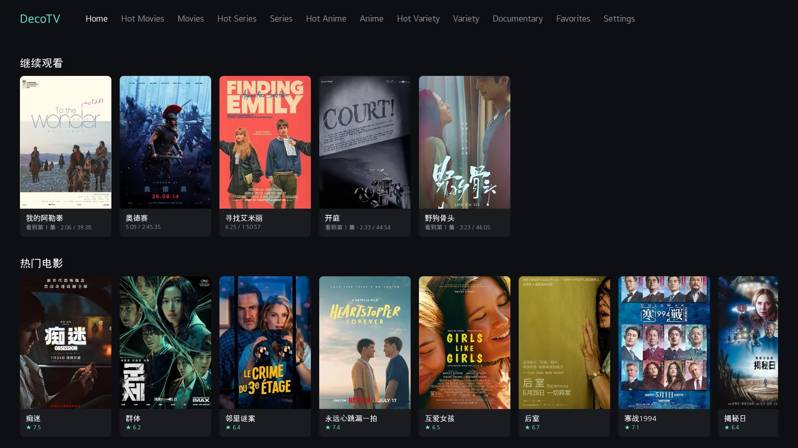
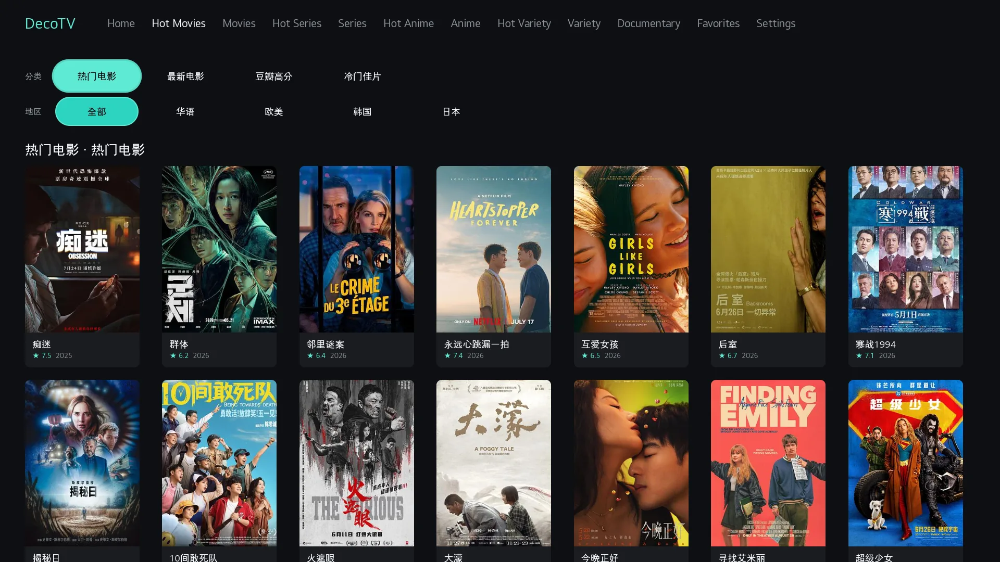
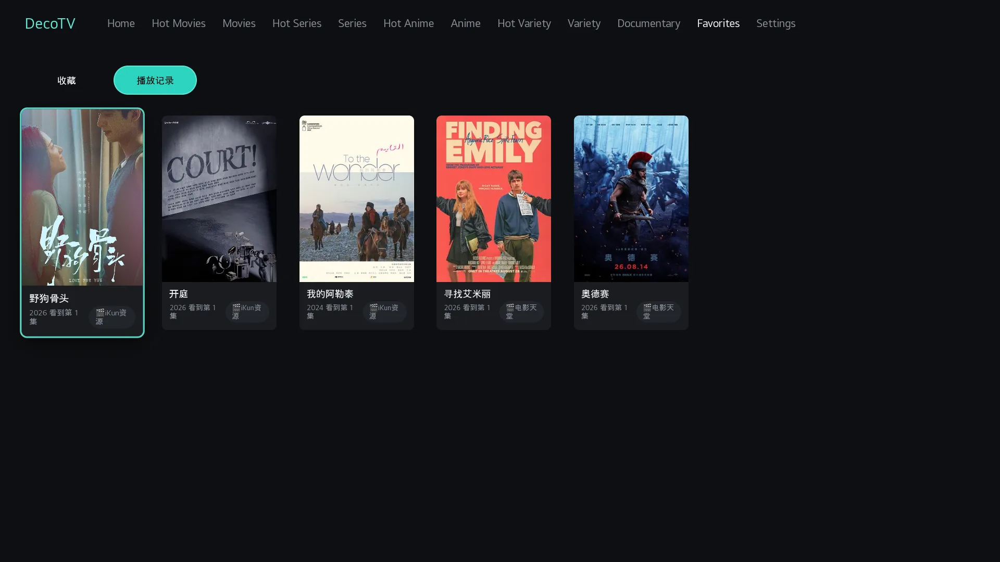
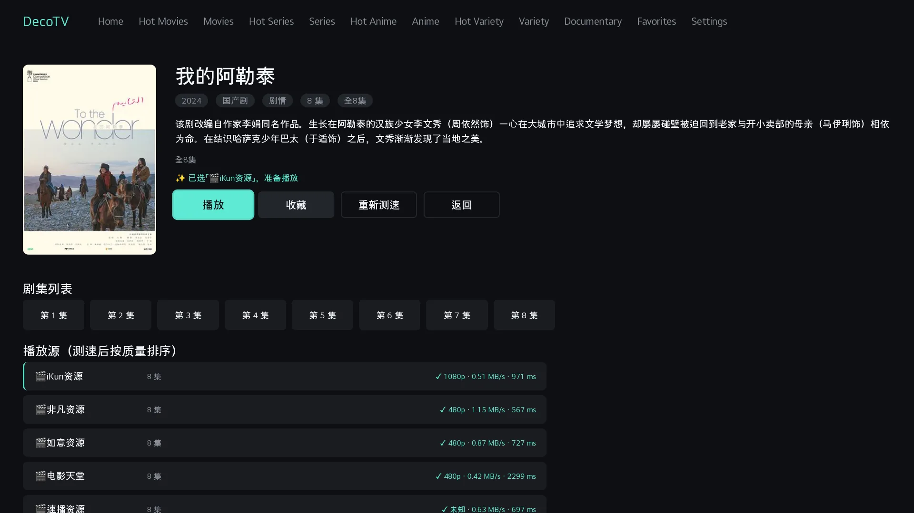
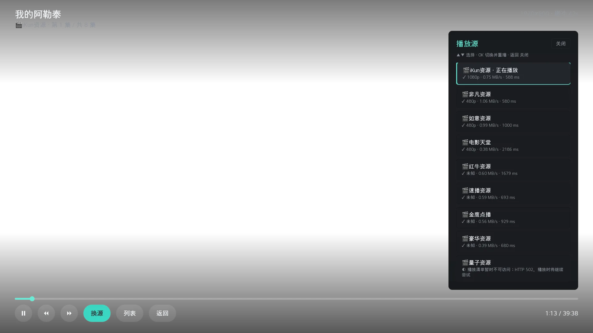
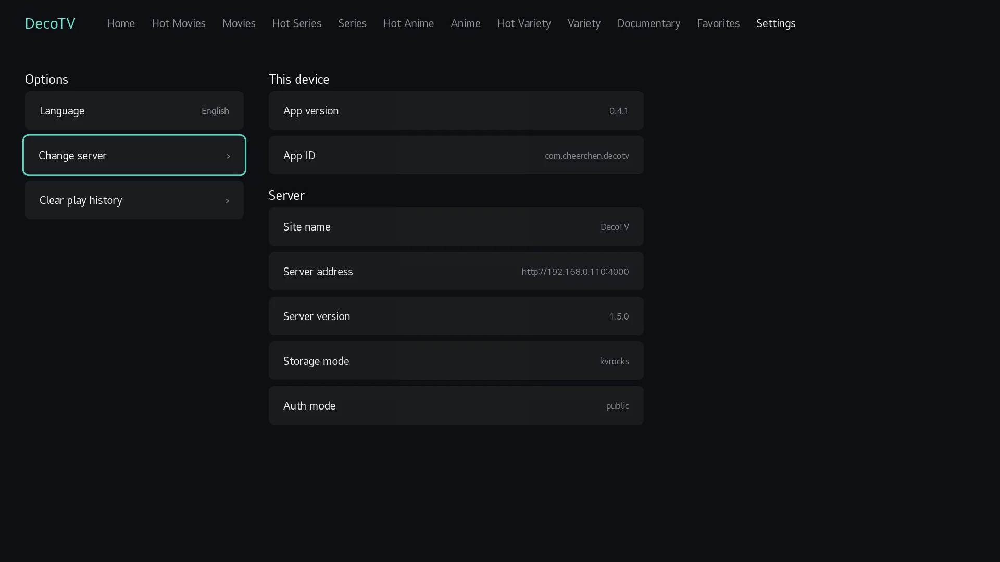

<!-- markdownlint-disable MD033 MD041 -->

<p align="center">
  
</p>

<h1 align="center">DecoTV for webOS</h1>

<p align="center">
  <strong>Native <a href="https://github.com/Decohererk/DecoTV">DecoTV</a> client for LG webOS TVs</strong><br />
  Douban / TMDB / Bangumi catalogs · multi-source probe ranking · full D-pad navigation · hardware decode
</p>

<p align="center">
  <a href="README.md"><b>中文</b></a>
  &nbsp;·&nbsp;
  <b>English</b>
</p>

<p align="center">
  <a href="https://github.com/CheerChen/decotv-webos/stargazers"></a>
  <a href="https://github.com/CheerChen/decotv-webos/releases"></a>
  
  
  
  
  <a href="LICENSE"></a>
</p>

---

## Screenshots

| Home | Category browse | Play history |
| :---: | :---: | :---: |
|  |  |  |

| Detail · multi-source probe | Player · source switch | Settings |
| :---: | :---: | :---: |
|  |  |  |

---

## What this is

A **purpose-built webOS TV client** for [DecoTV](https://github.com/Decohererk/DecoTV) — not a browser wrapper.

- Talks to a self-hosted DecoTV server: multi-source search, probe ranking, playback (the Douban catalog is fetched directly from m.douban.com, not through the server); the catalog can be switched to TMDB in settings (also fetched directly); the anime pages always use the Bangumi catalog (fetched directly), whatever the setting
- TV UI with remote D-pad focus navigation
- Native `<video>` **hardware HLS decode** on webOS (no HLS.js)
- **No root required** — Developer Mode or [Homebrew Channel](https://github.com/webosbrew/webos-homebrew-channel)

The server ships empty: **no built-in media sources**. Configure sources on the DecoTV server.

See [Releases](https://github.com/CheerChen/decotv-webos/releases) for packages and [CHANGELOG.md](CHANGELOG.md) for the update history.

---

## Features

| Feature | Notes |
| --- | --- |
| Home wall | Continue-watching on top; hot movie, series, anime and variety rows |
| Catalog browsing | Movies, series, variety and documentary come from Douban hot & curated tabs with region / genre / year filters; switch to the TMDB catalog in settings, with automatic fallback to Douban. Anime comes from Bangumi trending and subject search, with region / year / sort filters. Cards show the rating and its vote count |
| Auto page-load | Large category sets keep loading as focus approaches the end of the grid, up to 100 items per category — no manual paging |
| Work details | Rating (with its source and vote count), genres, summary, directors and cast come from the work's own catalog provider (Douban / TMDB / Bangumi); nothing is borrowed from another provider |
| Landscape hero | Optional: a landscape still fills the screen behind the details page (Settings → Details hero) |
| Multi-source probe ranking | All sources are measured concurrently, ranked by quality, throughput and startup latency; probing continues in the background and playback can start at any time with the best source so far |
| Detail page plays directly | Selecting an episode or a source starts playback; the episode grid sits above the (often long) source list, with the last-watched episode highlighted. TMDB series get episode cards with stills and titles, Bangumi works get episode title cards |
| Failover / manual switch | On failure, the best measured remaining source takes over from where playback stopped; in-player source side panel remains available. A source switched to in the player stays picked back on the details page, and a source that failed to play is marked there |
| Intro / outro marks | One button marks the intro or the outro (by whether the playhead is in the first or second half); pressed again it clears both. Every episode then skips the intro and advances at the outro |
| Progress memory | Keyed by title + year (survives source switch); the play button announces the episode it will resume |
| Library | Favorites & play history sync with the server once signed in; public mode or no session keeps them on the TV |
| Chinese / English UI | Follows the TV language (anything non-Chinese gets English), switchable in Settings; server-supplied content such as titles and genres stays Chinese |
| Remote UX | D-pad / OK / Back; digit keys `0–9` switch navigation; geometry focus engine |
| Hardware decode | Platform HLS, no HLS.js |

---

## Requirements

1. **LG webOS TV** (Developer Mode or Homebrew Channel; root optional)
2. **DecoTV server** (`public` mode works anonymously; syncing favorites and play history needs an account mode)
3. Network reachability from the TV to the server

Server setup: [DecoTV](https://github.com/Decohererk/DecoTV)

---

## Install

### A — Homebrew Channel

The app is listed in [webosbrew/apps-repo](https://github.com/webosbrew/apps-repo) and can be searched for and installed from Homebrew Channel on the TV.

### B — Developer Mode / sideload

Download a prebuilt IPK from [Releases](https://github.com/CheerChen/decotv-webos/releases).

**Developer Mode:** install with LG’s `ares-install`.

**Rooted TV (opkg path, bypasses appinstalld extraction failures):**

Replace `TV` with the TV’s LAN IP or an SSH host alias from `~/.ssh/config`.

```bash
scp com.cheerchen.decotv_*_all.ipk root@TV:/tmp/decotv.ipk
ssh root@TV 'opkg --add-dest developer:/media/developer install -d developer /tmp/decotv.ipk && \
          mkdir -p /media/developer/apps/usr/palm/applications/ && \
          cp -a /media/developer/usr/palm/applications/com.cheerchen.decotv \
                /media/developer/apps/usr/palm/applications/'
ssh root@TV 'sync; reboot'   # first install needs reboot for sam registration
```

---

## Quick start

1. Install and open **DecoTV**
2. Enter the server URL, e.g. `http://192.168.1.10:3000`
3. An account-mode server asks for a sign-in, then opens the home screen; `public` mode can be used without signing in
4. Browse the home wall with the D-pad; OK opens detail
5. Detail probes sources and starts the best one; switch sources on failure or via the panel
6. The player supports previous / next episode, intro / outro marks (intro skip and automatic episode advance)
7. Favorites and play history live under Library; client and server info are read-only on the right of Settings

---

## Stack

| Layer | Choice |
| --- | --- |
| Runtime | webOS Web App (WAM / Chromium) |
| Language | Native ES modules, no bundler |
| UI | Focus engine + screen router |
| Playback | Native `<video>` + UMS hardware decode |
| API | DecoTV / LunaTV-compatible HTTP |
| Session | webOS JS service (Node process, outside the webview) |
| Local data | `localStorage` (server URL, credentials, favorites, play history and intro / outro marks) |
| Package | `ares-package` → IPK |

---

## Development

```bash
# once after cloning: init the webos-tv-kit submodule (build + CDP tooling)
git submodule update --init

npm test

# Hot-update (rooted / already installed): push frontend sources + CDP reload, no repackage
# JS Service or appinfo.json changes still require a new package/install
# Replace TV with LAN IP or SSH host alias
scp -r js css index.html root@TV:/media/developer/apps/usr/palm/applications/com.cheerchen.decotv/
# CDP tunnel example: ssh -f -N -L 9977:localhost:9998 root@TV
uv run tvkit/scripts/cdp_reload.py --target decotv
```

App ID: `com.cheerchen.decotv`.

Debug tooling lives in [webos-tv-kit](https://github.com/CheerChen/webos-tv-kit) (`tvkit/scripts/`).

---

## Related

- [DecoTV](https://github.com/Decohererk/DecoTV) — server / web UI
- [webosbrew](https://github.com/webosbrew) — community tools and app catalog

---

## Disclaimer

- Client shell only — **no bundled media sources**
- Operators must deploy DecoTV and configure sources lawfully
- Do not promote this project bundled with piracy sources

---

## License

[MIT](LICENSE). Upstream DecoTV and third-party dependencies keep their own licenses.

---

## Star History

[](https://star-history.com/#CheerChen/decotv-webos&Date)
