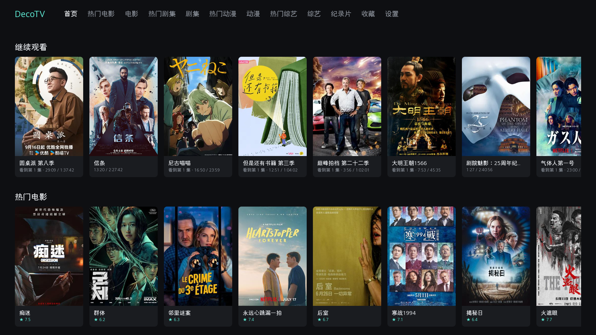
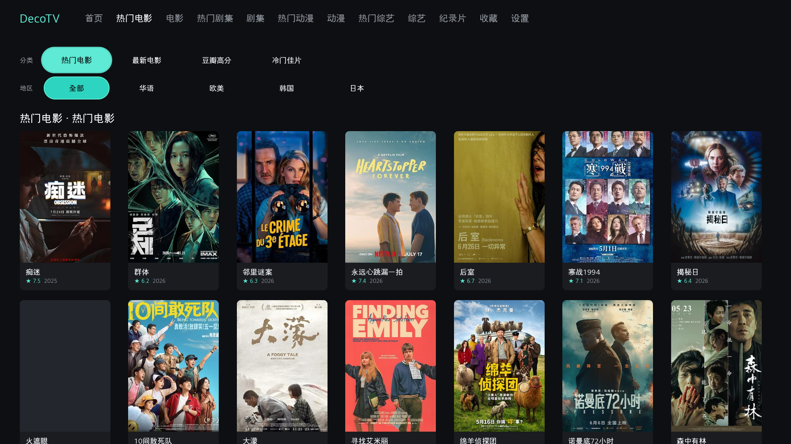
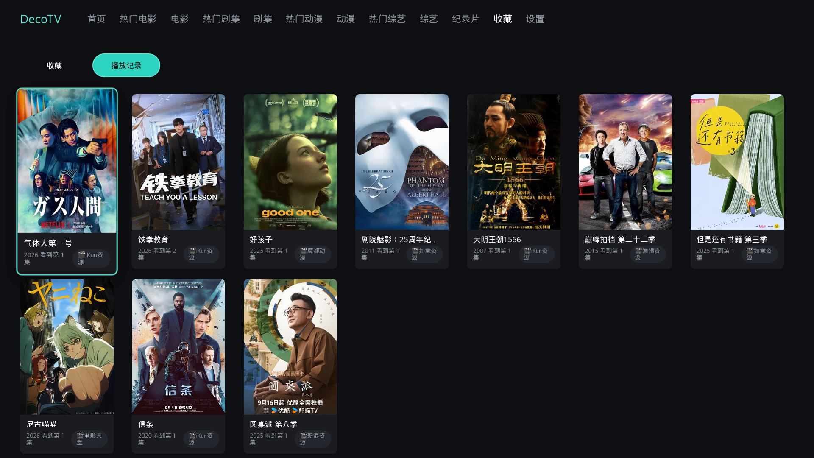
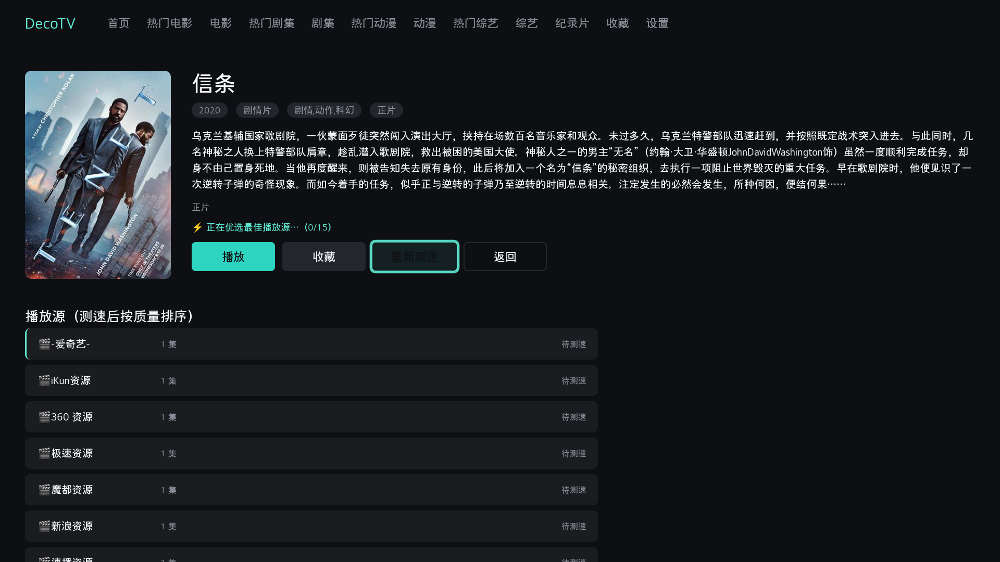
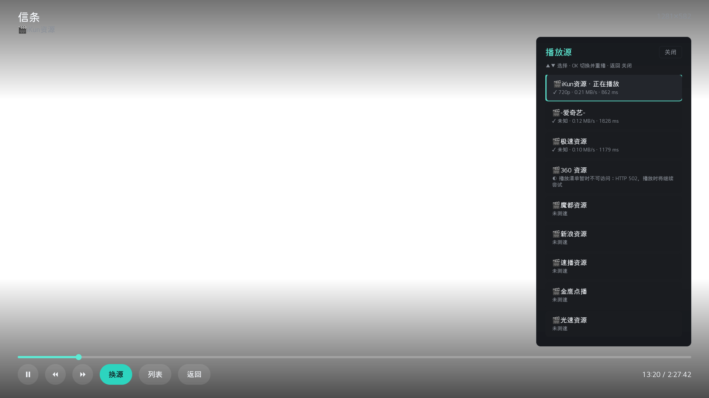
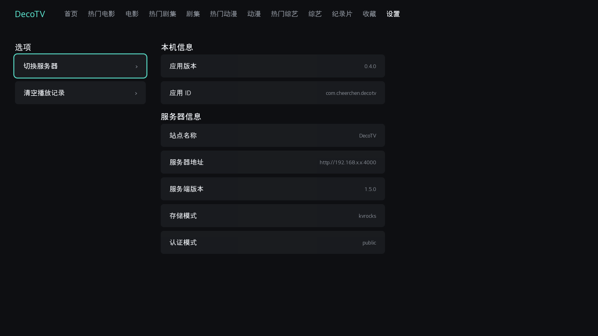

<!-- markdownlint-disable MD033 MD041 -->

<p align="center">
  
</p>

<h1 align="center">DecoTV for webOS</h1>

<p align="center">
  <strong>面向 LG webOS 电视的 <a href="https://github.com/Decohererk/DecoTV">DecoTV</a> 原生客户端</strong><br />
  豆瓣目录 · 多源测速优选 · 遥控器全导航 · 硬件解码播放
</p>

<p align="center">
  <b>中文</b>
  &nbsp;·&nbsp;
  <a href="README.en.md"><b>English</b></a>
</p>

<p align="center">
  <a href="https://github.com/CheerChen/decotv-webos/stargazers"></a>
  <a href="https://github.com/CheerChen/decotv-webos/releases"></a>
  
  
  
  
  <a href="LICENSE"></a>
</p>

---

## 项目展示

| 首页 | 分类浏览 | 播放记录 |
| :---: | :---: | :---: |
|  |  |  |

| 详情 · 多源测速 | 播放器 · 换源 | 设置 |
| :---: | :---: | :---: |
|  |  |  |

---

## 这是什么

本仓库是 **[DecoTV](https://github.com/Decohererk/DecoTV)** 在 **LG webOS 电视**上的专用客户端（非浏览器套壳）。

- 对接已部署的 DecoTV 服务端：豆瓣目录、分类筛选、聚合搜索、多源测速与播放
- 为 TV UI 与遥控器 D-pad 设计焦点导航
- 使用 webOS 原生 `<video>` **硬件解码 HLS**，不依赖 HLS.js
- **不需要 root**；开发者模式或 [Homebrew Channel](https://github.com/webosbrew/webos-homebrew-channel) 即可安装

服务端本身是空壳，**无内置片源**。片源需在 DecoTV 服务端自行配置。

当前版本见 [Releases](https://github.com/CheerChen/decotv-webos/releases)。

---

## 功能特性

| 能力 | 说明 |
| --- | --- |
| 首页海报墙 | 继续观看置顶；热门 / 最新电影与剧集分行展示 |
| 分类浏览 | 顶栏进入热门与精选：电影、剧集、动漫、综艺、纪录片；chip 筛选地区 / 类型 / 年份等 |
| 多源测速优选 | 详情页并发检测播放源，按分辨率 → 吞吐 → 启动时延排序，自动起播最优源 |
| 剧集优先布局 | 多集内容时剧集列表在播放源上方，避免被长源列表顶出视口 |
| 播放失败换源 | 当前源失败后自动切下一源；播放中可打开换源侧栏手动切换 |
| 进度记忆 | 按「标题 + 年份」记进度，换源不丢断点；支持继续观看 |
| 本机收藏与记录 | 收藏 / 播放记录存在电视本地；设置中可清空播放记录 |
| 设置分区 | 左侧可操作（切换服务器、清空记录），右侧只读（本机信息 + 服务器信息） |
| 遥控器导航 | D-pad / OK / 返回全覆盖；几何焦点引擎 |
| 播放器 OSD | 实时分辨率与缓冲；选集 / 换源侧栏 |
| 硬件解码 | 系统原生 HLS，无 HLS.js |

### 与 PC 端的差异（必读）

| 项目 | PC / 浏览器 DecoTV | 本客户端 (webOS) |
| --- | --- | --- |
| 认证 | 支持账号密码等模式 | **仅 `public` 认证模式**（见下） |
| 收藏 / 进度 | 可与服务端同步 | **电视本地** `localStorage`，不跨设备同步 |
| 片源配置 | 服务端后台 | 同左——客户端不配置片源 |
| 播放解码 | HLS.js / ArtPlayer 等 | 系统原生硬件解码 |

**为何只支持 `public`：** 应用从 `file://` 加载，请求服务端属于跨站；`SameSite=Lax` 会话 Cookie 无法在电视 WebView 中保存，应用也不能手动读写 Cookie。因此需服务端使用 `public` 模式，才能匿名完成浏览、搜索与播放。

```bash
NEXT_PUBLIC_AUTH_MODE=public
```

若指向非 `public` 服务，会在 app 服务器配置页提示切换。

---

## 要求

1. **LG webOS 电视**（开发者模式或已装 Homebrew Channel；root 非必须）
2. **已部署的 DecoTV 服务**，且 `AuthMode = public`
3. 电视与服务端网络可达（同局域网或可访问的域名 / IP）

服务端部署参见：[DecoTV](https://github.com/Decohererk/DecoTV)

---

## 安装

### 方式 A — Homebrew Channel（规划中）

上架 [webosbrew/apps-repo](https://github.com/webosbrew/apps-repo) 后，可在电视 Homebrew Channel 中搜索安装。

### 方式 B — 开发者模式 / 手动 sideload

从 [Releases](https://github.com/CheerChen/decotv-webos/releases) 下载已构建 IPK。

**开发者模式：** 使用 LG 官方 `ares-install` 安装 IPK。

**已 root 电视（opkg 路径，绕过 appinstalld 解包失败）：**

将下方 `TV` 换成电视的局域网 IP，或本机 `~/.ssh/config` 中已配置的主机名。

```bash
scp com.cheerchen.decotv_*_all.ipk root@TV:/tmp/decotv.ipk
ssh root@TV 'opkg --add-dest developer:/media/developer install -d developer /tmp/decotv.ipk && \
          mkdir -p /media/developer/apps/usr/palm/applications/ && \
          cp -a /media/developer/usr/palm/applications/com.cheerchen.decotv \
                /media/developer/apps/usr/palm/applications/'
ssh root@TV 'sync; reboot'   # 首次安装需重启，sam 才会注册应用
```

也可本地打包：

```bash
# -n 必须：源码为原生 ES modules，内置压缩器无法处理
ares-package . -n
# → com.cheerchen.decotv_<version>_all.ipk
```

---

## 快速开始

1. 安装并打开 **DecoTV**
2. 输入服务端地址，例如 `http://192.168.1.10:3000`
3. 首页用方向键浏览，OK 进入详情
4. 详情页自动测速并优选播放源；失败时自动或手动换源
5. 收藏与播放记录在「收藏」页；本机信息与服务器信息在「设置」页右侧只读区

---

## 技术栈

| 层级 | 选型 |
| --- | --- |
| 运行时 | webOS Web App (WAM / Chromium) |
| 语言 | 原生 ES modules，无构建步骤 |
| UI | 焦点引擎 + 屏幕路由 |
| 播放 | 原生 `<video>` + UMS 硬件解码 |
| 服务协议 | DecoTV / LunaTV 兼容 HTTP API |
| 本地数据 | `localStorage`（收藏、播放记录、服务器地址） |
| 打包 | `ares-package` → IPK |

---

## 开发

```bash
# 单元测试
npm test

# 热更新（已 root / 已装应用）：推送源码后 CDP 刷新，无需重打包
# 将 TV 换成电视局域网 IP 或 SSH 主机名
scp -r js css index.html root@TV:/media/developer/apps/usr/palm/applications/com.cheerchen.decotv/
# CDP 隧道示例：ssh -f -N -L 9977:localhost:9998 root@TV
uv run scripts/cdp_reload.py
```

应用 ID：`com.cheerchen.decotv`。

可选调试脚本：`scripts/cdp_eval.py`、`scripts/cdp_reload.py`、`scripts/cdp_screenshot.py`。

---

## 相关项目

- [DecoTV](https://github.com/Decohererk/DecoTV) — 服务端 / Web 端
- [webosbrew](https://github.com/webosbrew) — webOS 社区工具与应用仓库
- [youtube-webos](https://github.com/webosbrew/youtube-webos)
- [jellyfin-webos](https://github.com/jellyfin/jellyfin-webos)

---

## 免责声明

- 本项目为客户端壳，**不提供、不内置任何影视资源**
- 使用者需自行部署 DecoTV 并合法配置数据源，后果自负
- 请勿在未获授权的公开渠道将本项目与盗版资源捆绑宣传

---

## License

[MIT](LICENSE)。上游 DecoTV 与第三方依赖遵循各自许可证。

---

## Star History

[](https://star-history.com/#CheerChen/decotv-webos&Date)
